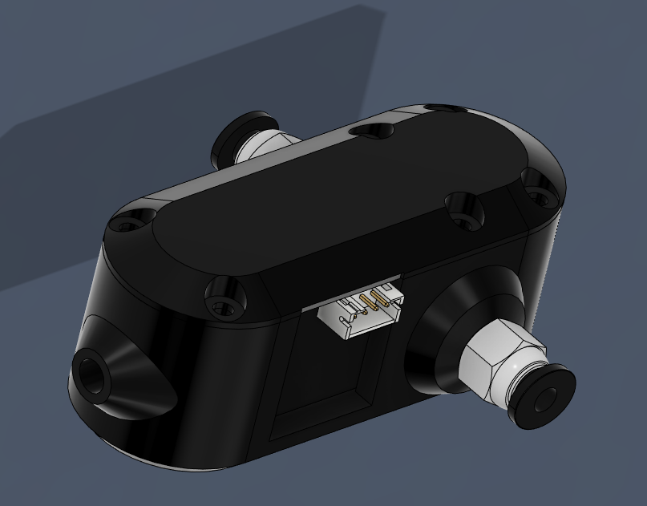
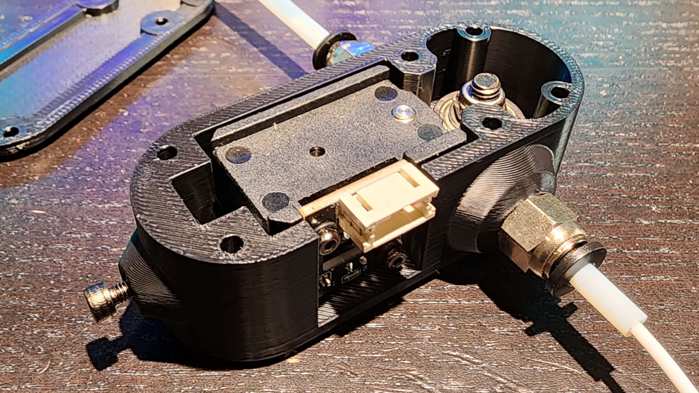
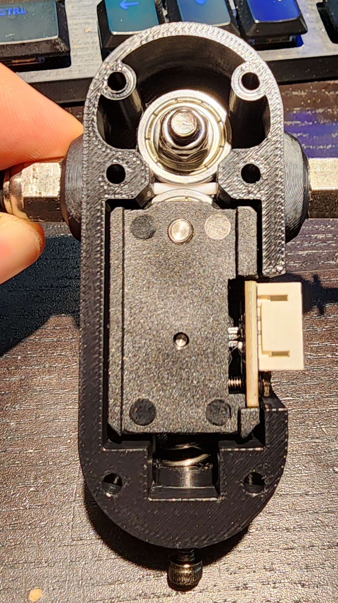

# BTT-SFS-Adjustable-Tension-Mod
A replacement housing and lid for the BTT SFS filament sensor that includes provisions to adjust the compression on the internal spring.

This mod fully replaces the entire housing with new printed parts.  You may be able to reuse the original lid, however the original housing has an odd taper at one side of the injection molded part so the original lid may not fit properly.  Mounting holes in the new lid are close enough that other bolt-on SFS mods should still fit.

# Required Parts
**Printed Parts**

Housing - Fully replaces the existing SFS housing

Spring Cup - A cup you may put a spring into

Lid - Replacement lid for the new housing

**Hardware**

1x M3 Brass Heat-Set insert (If you're from the VORON community you probably have more than enough of these floating around.)

1x M3x10 cap-head screw.  The tension on the spring is low enough this can easily be turned by hand.

## Print Settings

For an ideal fit and finish, use the typical settings used to print VORON parts.  At a minimum, use 4 perimeters and a 0.2mm layer height.  5 solid layers top and bottom, 40% infill.  My example is printed in black KVP ABS.

The replacement lid includes print-in-place supports as part of the .stl file which expect a 0.2mm layer height.  If your printer is set up correctly these should easily pop off by hand.
